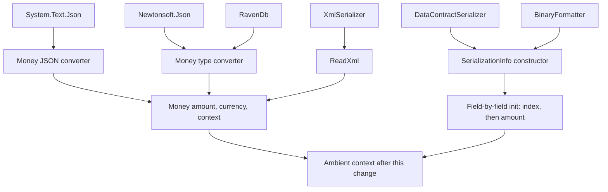

# Deserialization Money Context - Plan

## Goal Capsule

- **Objective:** An application that reads a `Money` value from any supported serialization format gets a value that behaves like one it constructed itself: rounded the same way, and usable in arithmetic against other `Money` values without an unexpected exception.
- **Means:** Deserialize with the ambient context instead of a forced no-rounding context, and add an opt-in setting for callers who want exact round-tripping back (KTD1, KTD2).
- **Authority:** Requirements win on behavior. Key Technical Decisions win on mechanism inside those requirements. Units override neither.
- **Stop conditions:** Stop and ask before changing the serialized wire format, before widening public API beyond the converter constructor, and before changing how `Money` arithmetic reacts to two different contexts.
- **Execution profile:** One behavioral rule applied across four deserialization entry points, then pinned by tests across all six serialization technologies.

---

## Product Contract

### Summary

Make deserialization adopt the ambient `MoneyContext` in every serialization technology the library supports, replacing the forced no-rounding context that currently poisons deserialized values for arithmetic. Add a constructor argument on the System.Text.Json converter so callers who relied on exact round-tripping can opt back in. Ship it as a documented breaking change.

### Problem Frame

Issue #119 reports that a deserialized `Money` is not interchangeable with a constructed one. Deserialization forces `MoneyContext.NoRounding`, so `JsonSerializer.Deserialize<Money>("\"EUR 10.00\"")` and `new Money(10, "EUR")` compare equal but diverge under multiplication and throw `MoneyContextMismatchException` under addition (`src/NodaMoney/Money.BinaryOperators.cs:99,141`).

The context is part of the arithmetic contract, not only a rounding preference, so the current default quarantines every deserialized value from the rest of the application. The failure surfaces far from the deserialization call, which is what made it hard to diagnose in the issue.

The library already disagrees with itself. `Money.Parse` (`src/NodaMoney/Money.Parsable.cs:49`) and both XML read paths (`src/NodaMoney/Money.Serializable.cs:117,134`) construct with the ambient context. Only System.Text.Json, the type converter used by Newtonsoft, and the binary/DataContract constructor force no-rounding.

### Key Decisions

- KD1. **Deserialization adopts the ambient context.** (session-settled: user-approved, chosen over keeping no-rounding with better documentation, a hybrid that picks the context from the payload value, and serializing the context itself: the no-rounding default breaks arithmetic against normally constructed values, and only callers who deliberately serialized a no-rounding value have a true round-trip to protect.) Governs R1, R2, R3, R4.
- KD2. **Exact round-tripping stays available as an opt-in, not a default.** (session-settled: user-approved, chosen over preserving exact round-tripping by default: the callers who need it are a small minority and can ask for it explicitly.) Governs R5, R6.
- KD3. **No new public surface on `MoneyContext`.** (session-settled: user-directed, chosen over making the internal no-rounding context public: `MoneyContext.Create` already returns the same deduplicated instance for equal options, so a public field adds surface without adding capability.) Governs R7.

### Requirements

**Deserialization behavior**

- R1. Every deserialization entry point constructs `Money` with the ambient `MoneyContext` rather than the internal no-rounding context.
- R2. The rule holds for System.Text.Json, Newtonsoft.Json, RavenDb, `DataContractSerializer`, `BinaryFormatter`, and both XML formats. XML already satisfies it and must keep doing so.
- R3. A deserialized `Money` adds to, subtracts from, and compares with a constructed `Money` of the same currency without raising `MoneyContextMismatchException`.
- R4. An amount carrying more decimals than the ambient context allows is rounded by that context's strategy during deserialization, matching what `Money.Parse` does with the same text.

**Opt-in exact round-tripping**

- R5. The System.Text.Json converter accepts a `MoneyContext` so a caller can restore byte-exact round-tripping without writing a converter.
- R6. A caller using any technology can restore exact round-tripping by setting the ambient context to a no-rounding context around the deserialization call. Rewriting a deserialized value's context afterwards does not qualify: the context init accessor re-labels the value without re-rounding it, so precision already lost at parse time stays lost.

**Compatibility and documentation**

- R7. Public API growth is limited to the converter constructor. No other type gains public members.
- R8. The change is documented as breaking, naming the new rounding behavior and the opt-in path per technology.

### Scope Boundaries

- The serialized wire format does not change. Serialization output is byte-identical before and after.
- `Currency` serialization is untouched. It carries no context.
- `FastMoney`, `ExtendedMoney`, `Price`, and `Transaction` carry no serialization surface and are not part of this work.

#### Deferred to Follow-Up Work

- Two `Money` values with any two different contexts still throw on mixed addition and subtraction. That is the deeper tension behind the issue report and deserves its own issue, covering whether the context should be resolved from the left operand instead.
- The Newtonsoft V1 object-format tests are skipped in the repo with the note that they cannot be fixed without a Newtonsoft dependency. This plan does not revive them.

### Sources

- Issue #119, including the reporter's three-assertion reproduction and the exchange about round-tripping against safety.
- `src/NodaMoney/Money.cs:38-75` for how the constructor applies the rounding strategy and packs the context index.
- `src/NodaMoney/Money.BinaryOperators.cs:91-145` for the context-mismatch throw sites.
- `AGENTS.md` for the bit-packing contract, the context registry, and the warning-free build requirement.

---

## Planning Contract

### Key Technical Decisions

- KTD1. **Pass no context at the deserialization sites and let the constructor resolve the ambient one.** The `Money` constructor already falls back to `MoneyContext.CurrentContext` when the context argument is null, so the fix is the removal of an argument rather than new resolution logic. Instantiates KD1; governs R1, R2, R4.
- KTD2. **Put the converter opt-in on the System.Text.Json constructor, and treat the ambient context scope as the general escape hatch.** Only that converter can be instantiated by the caller and registered in `JsonSerializerOptions.Converters`. The type converter behind Newtonsoft and the `ISerializable` constructor are built by the framework from the type attribute and cannot take an argument, so their escape hatch is the ambient context: once KTD1 lands, deserialization reads whatever context is current, and a caller can wrap the call in a no-rounding scope. Instantiates KD2; governs R5, R6.
- KTD3. **Set the context index explicitly in the `ISerializable` constructor before assigning the amount.** That constructor builds the value field by field rather than through the main constructor, and an unset index means index 0, which is standard banker's rounding rather than the ambient context. The `Amount` init accessor reads `Context` to pick a rounding strategy, so the index must be correct before the amount is assigned. Governs R1 on the binary and DataContract path.
- KTD4. **Leave the XML read paths alone and pin them with tests.** Both already construct with the ambient context, so editing them would add risk without changing behavior. Governs R2.

### High-Level Technical Design

Six serialization technologies converge on four deserialization entry points, which in turn use two construction paths. Only the shaded group forces the no-rounding context today.

Current versus intended context per entry point:

| Entry point | Technologies | Context today | Context after |
|---|---|---|---|
| JSON converter, string and object form | System.Text.Json | No-rounding | Ambient, or the converter's configured context |
| Type converter | Newtonsoft.Json, RavenDb | No-rounding | Ambient |
| `SerializationInfo` constructor | DataContractSerializer, BinaryFormatter | No-rounding | Ambient |
| `ReadXml`, V1 and V2 formats | XmlSerializer | Ambient | Ambient, unchanged |

### Assumptions

- A converter instance registered in `JsonSerializerOptions.Converters` takes precedence over the converter named by the type-level attribute. This is standard System.Text.Json precedence but the opt-in path depends on it, so U2 proves it with a test rather than assuming it.
- The ambient context at deserialization time is the right context for the value. An application that deserializes inside a context scope gets that scope's context, which is the same rule parsing already follows.
- No consumer depends on over-scale amounts surviving a JSON round-trip today. The repository's own test data uses in-scale amounts everywhere except the one case the issue cites.

### Sequencing

U1 carries the behavioral change and must land before U3 can pin it. U2 is independent of U1 but shares the same file, so landing U1 first avoids a conflict. U4 documents what U1 and U2 established.

---

## Implementation Units

### U1. Ambient context at every deserialization entry point

**Goal:** Remove the forced no-rounding context from all three entry points that still use it, so deserialized values match constructed ones.

**Requirements:** R1, R2, R3, R4. Implements KD1 through KTD1 and KTD3.

**Dependencies:** none.

**Files:**
- `src/NodaMoney/Serialization/MoneyJsonConverter.cs`
- `src/NodaMoney/Serialization/MoneyTypeConverter.cs`
- `src/NodaMoney/Money.Serializable.cs`
- `tests/NodaMoney.Tests/Serialization/NewtonsoftJsonSerializerSpec/DeserializeMoney.cs`
- `tests/NodaMoney.Tests/Serialization/SystemTextJsonSerializationSpec/DeserializeMoney.cs`
- `tests/NodaMoney.Tests/Serialization/DataContractSerializerSpec/SerializeMoney.cs`

**Approach:**
1. In the JSON converter, drop the context argument at the three construction sites: the string form, the reversed string form, and the V1 object form.
2. In the type converter, drop it at both construction sites.
3. In the `SerializationInfo` constructor, set the context index from the ambient context before assigning the amount, per KTD3. Leaving the index unset would silently select banker's rounding rather than the ambient context.
4. Update the comment at each site. The current text claims the exact serialized state is being restored, which stops being true.
5. Update the one existing test that asserts the old behavior, in the Newtonsoft deserialize spec. It expects `EUR 123.456` to survive unrounded; it now expects `123.46` with the ambient context. This is the exact case issue #119 cites.

**Patterns to follow:** the XML read paths in `src/NodaMoney/Money.Serializable.cs` already construct with the ambient context and are the reference shape for the other entry points.

**Execution note:** write the arithmetic-interop test from the issue first. It fails today with a context-mismatch exception and is the sharpest proof the fix landed.

**Test scenarios:**
- Deserializing `"EUR 123.456"` with System.Text.Json yields amount `123.46` and a context equal to `MoneyContext.CurrentContext`.
- Deserializing the reversed form `"123.456 EUR"` yields the same amount and context.
- Deserializing the V1 object form with an over-scale amount rounds to the currency's scale.
- Deserializing `"EUR 123.456"` with Newtonsoft yields `123.46` and the ambient context.
- Adding a deserialized `Money` to a constructed `Money` of the same currency returns their sum instead of throwing `MoneyContextMismatchException`.
- Multiplying a deserialized `EUR 10.00` by `0.1234m` equals the same operation on a constructed `new Money(10, "EUR")`.
- Deserializing inside a scope whose context uses away-from-zero rounding produces a value carrying that scope's context.
- Deserializing `"JPY 765.4321"` rounds to `765`, and `"BTC 765.43214321"` keeps all eight decimals.
- Deserializing `"EUR 0"` yields the ambient context, proving the constructor's zero fast path still stores the index.
- Deserializing `null` into `Money?` still returns null, and into `Money` still throws.
- A DataContract round-trip of a constructed value returns a value whose context equals the ambient context.

**Verification:** the reproduction from issue #119 passes all three of its assertions except the one asserting the contexts differ, which is now expected to show them equal. The full test suite passes on every target framework.

### U2. Opt-in context on the System.Text.Json converter

**Goal:** Let a caller restore exact round-tripping by configuring the converter instead of writing their own.

**Requirements:** R5, R6, R7. Implements KD2 through KTD2.

**Dependencies:** U1.

**Files:**
- `src/NodaMoney/Serialization/MoneyJsonConverter.cs`
- `tests/NodaMoney.Tests/Serialization/SystemTextJsonSerializationSpec/DeserializeMoney.cs`

**Approach:**
1. Give the converter an optional context constructor argument, defaulting to none so the attribute-driven instance keeps the U1 behavior.
2. Use the configured context at all three construction sites when one was supplied, otherwise fall through to ambient.
3. Document on the constructor that the context should be created once and reused. Context creation deduplicates on equal options, so repeated creation costs a registry scan rather than an index.
4. Leave the write path untouched. Serialization output must not change.

**Patterns to follow:** the existing converter keeps its parsing helpers static; keep the configured context reachable from them without turning them into instance members if that stays cleaner.

**Test scenarios:**
- A converter built with a no-rounding context and registered in serializer options deserializes `"EUR 123.456"` to exactly `123.456`.
- That registered instance governs over the converter named by the type attribute, proving the opt-in path actually takes effect.
- A converter built with no argument behaves exactly as U1 specifies.
- A converter built with a context that rounds away from zero applies that strategy rather than the ambient one.
- Serializing through a configured converter produces the same string as serializing through the default one.

**Verification:** a caller can restore the pre-change deserialization behavior with converter registration alone, without a custom converter type.

### U3. Pin deserialization context across every serialization technology

**Goal:** Make the shared rule regression-proof so the technologies cannot drift apart again.

**Requirements:** R2, R3.

**Dependencies:** U1.

**Files:**
- `tests/NodaMoney.Tests/Serialization/SystemTextJsonSerializationSpec/DeserializeMoney.cs`
- `tests/NodaMoney.Tests/Serialization/NewtonsoftJsonSerializerSpec/DeserializeMoney.cs`
- `tests/NodaMoney.Tests/Serialization/XmlSerializationSpec/DeserializeMoney.cs`
- `tests/NodaMoney.Tests/Serialization/DataContractSerializerSpec/SerializeMoney.cs`
- `tests/NodaMoney.Tests/Serialization/BinaryFormatterSpec/SerializeMoney.cs`

**Approach:**
1. Add a context assertion to the deserialize spec of each technology, including XML, which already behaves correctly and is the reference.
2. Add the arithmetic-interop assertion to at least one spec per technology, since equality alone does not catch a context difference.
3. Follow the existing skip conditions rather than fighting them: the binary spec is skipped on .NET 8 and above, and the RavenDb spec runs only on .NET 9. The DataContract spec exercises the same constructor as the binary path on every framework, so the constructor stays covered where the binary formatter cannot run.

**Patterns to follow:** the existing per-technology spec folders under `tests/NodaMoney.Tests/Serialization/`, with the repository's `When[Precondition]_Should[Behavior]` naming.

**Test scenarios:**
- For each technology, a deserialized value carries a context equal to `MoneyContext.CurrentContext`.
- For each technology, a deserialized value adds to a constructed value of the same currency without throwing.
- The XML V1 attribute format and the V2 element format both yield the ambient context.
- A RavenDb store-and-read cycle returns a value whose context equals the ambient one, under the spec's existing framework guard.

**Verification:** every serialization spec folder contains at least one assertion about the resulting context, and the suite passes on all target frameworks.

### U4. Document the behavior change and the opt-in paths

**Goal:** Give users the reason their over-scale amounts now round, and the way back if they need exact round-tripping.

**Requirements:** R8, R6.

**Dependencies:** U1, U2.

**Files:**
- `README.md`
- `src/NodaMoney/Serialization/MoneyJsonConverter.cs`
- `src/NodaMoney/Serialization/MoneyTypeConverter.cs`

**Approach:**
1. Add a short serialization-and-context passage to the README's context section, next to the existing text about rewriting a value's context. State the rule once: deserialization adopts the ambient context.
2. Name the opt-in per technology. Converter registration for System.Text.Json, and a no-rounding context scope around the deserialization call for every technology including System.Text.Json.
3. Correct the existing README line that offers a context rewrite on an already-deserialized value as the escape path. It resolves a context mismatch but does not recover precision, because the context init accessor does not re-round the stored amount.
4. Update the XML documentation comments on both converters so the behavior is visible from the IDE.
5. Write the release note as a breaking change, naming the rounding of over-scale amounts as the visible effect.

**Test expectation:** none, documentation only.

**Verification:** a reader who hits the rounding change finds both the reason and the opt-in without opening the source.

---

## Verification Contract

| Gate | Command | Applies to |
|---|---|---|
| Build is warning-free | `dotnet build NodaMoney.slnx -c Release` | U1, U2, U3 |
| Full suite, all frameworks | `dotnet test` | U1, U2, U3 |
| Single framework during iteration | `dotnet test -f net10.0` | U1, U2, U3 |
| Serialization specs only | `dotnet test -f net10.0 --filter "FullyQualifiedName~Serialization"` | U1, U2, U3 |
| Arithmetic interop unaffected | `dotnet test -f net10.0 --filter "FullyQualifiedName~MoneyBinaryOperatorsSpec"` | U1 |

`EnforceCodeStyleInBuild` is on with Roslynator and the Microsoft quality analyzers, so an analyzer finding fails the gate. No package changes are expected, so the committed lock files should not need regeneration; if a package does change, regenerate with `dotnet restore --force-evaluate` and commit the result. The `net48` leg needs Windows, which this repository's working environment provides.

---

## Definition of Done

**Global**

- No deserialization entry point references the internal no-rounding context.
- The three assertions in issue #119 behave as the fix intends: values equal, contexts equal, and multiplication results equal.
- Public API growth is the converter constructor and nothing else.
- The build is warning-free and the suite passes on every target framework the environment can run.
- No exploratory or abandoned code remains in the diff.

**Per unit**

| Unit | Done when |
|---|---|
| U1 | All three entry points construct with the ambient context, the binary path sets its index before its amount, and the one stale Newtonsoft expectation is corrected |
| U2 | A configured converter restores exact round-tripping, and a test proves the registered instance governs over the type attribute |
| U3 | Every serialization spec folder asserts the resulting context and proves arithmetic interop |
| U4 | The README states the rule and the per-technology opt-in, and both converters carry matching XML documentation |
